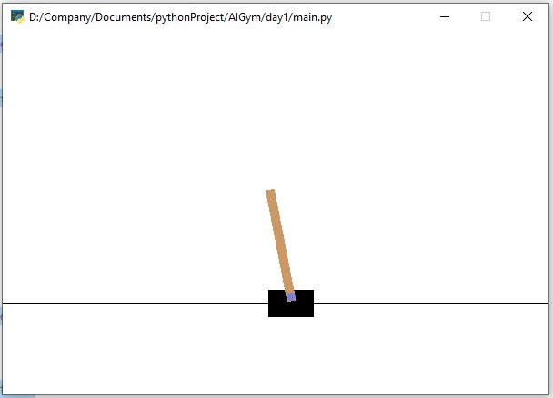

## AI GYM
Tried AI Gym over the weekend to see its has out of the box capabilities. 
Created a very basic QNet to learn how to balance a poll.
However, while the code runs and the AI is learning there is a
lot of further optimisations that needs to be done for it to be perfect. 

